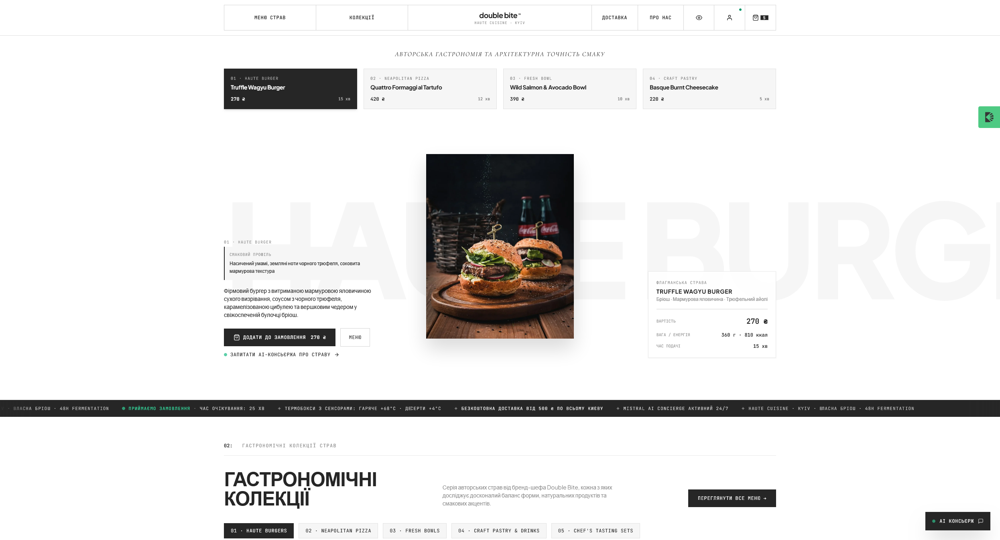
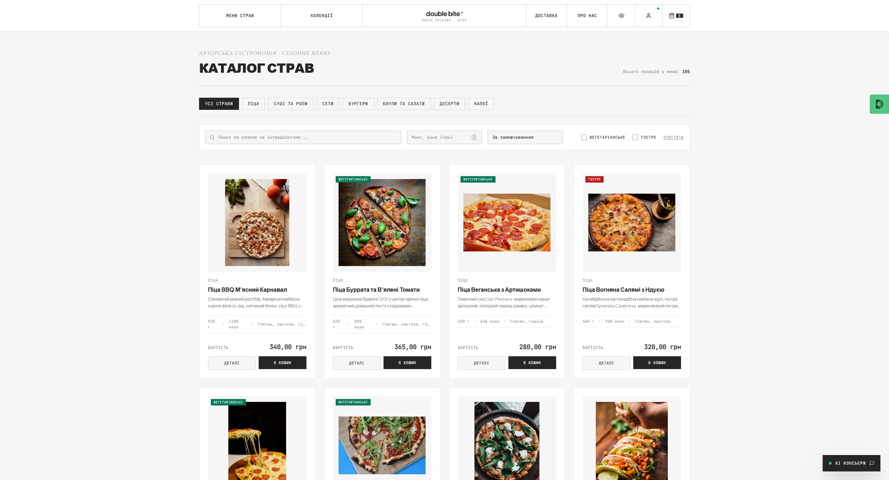
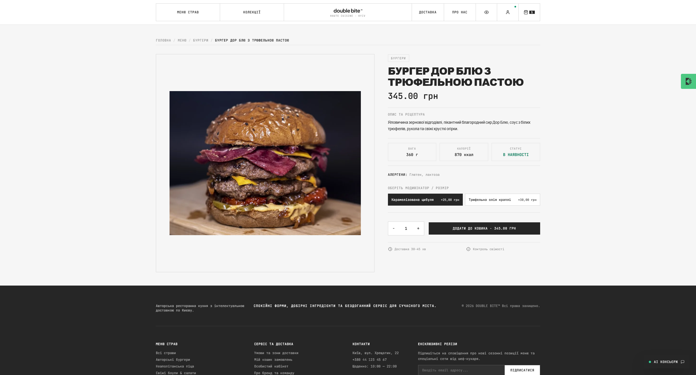
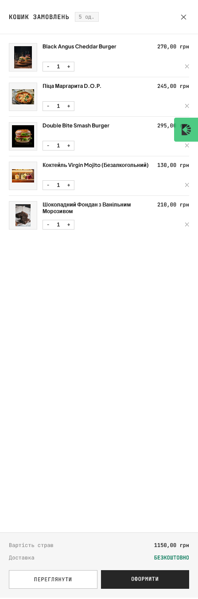
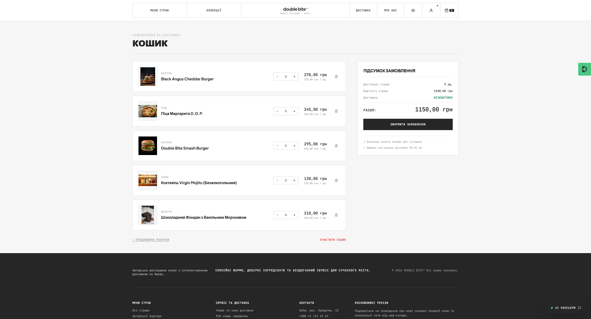
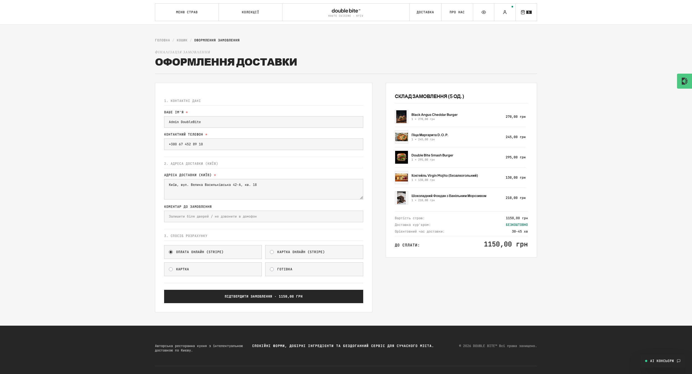
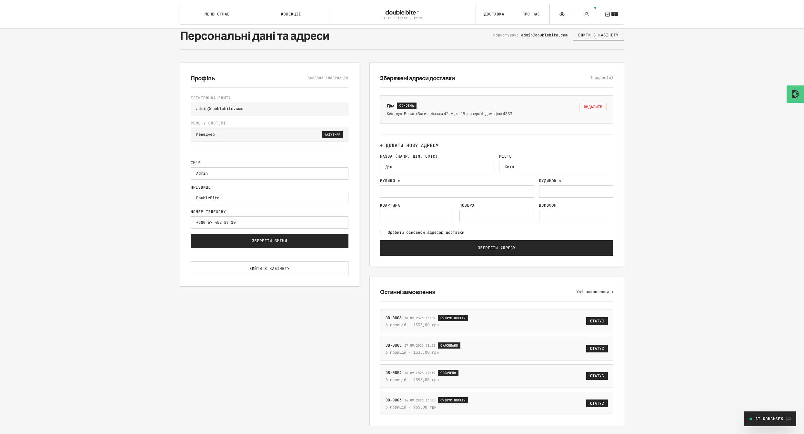
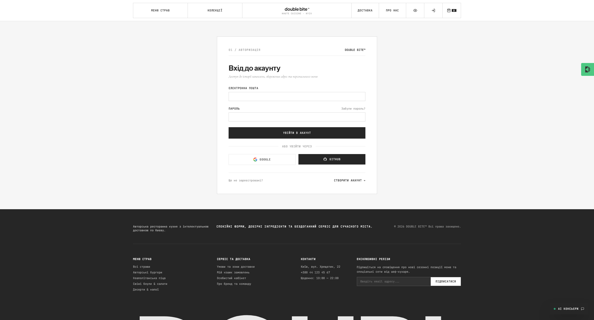
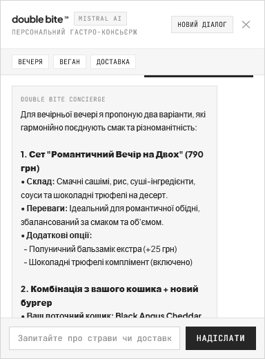
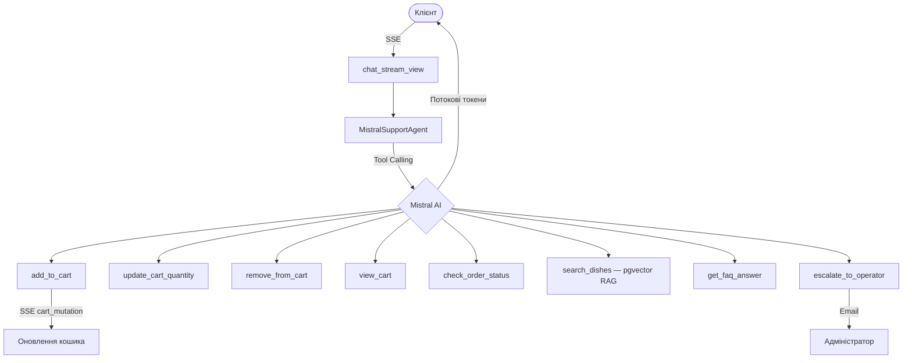

# Double Bite

Платформа онлайн-замовлення їжі з AI-чатботом підтримки 24/7.

| Releases & Framework | Data & Infrastructure | Security & AI | CI & Project Info |
| :---: | :---: | :---: | :---: |
| [](https://github.com/iDeash123/DoubleBite)<br>[](https://www.python.org/)<br>[](https://www.djangoproject.com/)<br>[](https://htmx.org/) | [-336791.svg?logo=postgresql&logoColor=white)](https://www.postgresql.org/)<br>[](https://redis.io/)<br>[](https://min.io/)<br>[-635BFF.svg?logo=stripe&logoColor=white)](https://stripe.com/) | [](https://mistral.ai/)<br>[](#ai-chatbot)<br>[](#testing)<br>[](https://tailwindcss.com/) | [](#testing)<br>[-brightgreen.svg?logo=pytest&logoColor=white)](#testing)<br>[](https://astral.sh/uv)<br>[](https://github.com/astral-sh/ruff)<br>[](LICENSE) |

---

## Можливості

- 🛒 Каталог страв з фільтрацією за категорією, ціною, дієтою (HTMX 2 + Django Template Partials)
- 💳 Оплата через Stripe Checkout (картка, Apple/Google Pay) або при доставці
- 🤖 AI-чатбот на Mistral AI з tool calling — додає страви в кошик, перевіряє статус замовлення, шукає по меню (RAG через pgvector)
- 📦 Трекінг замовлень у реальному часі (HTMX polling, state machine `PENDING → PAID → PREPARING → ON_WAY → DELIVERED`)
- 🔐 Авторизація: email/пароль + Google та GitHub OAuth 2.0 (django-allauth)
- 📧 Транзакційні email: підтвердження замовлення, чеки Stripe, статуси доставки, ескалація тікетів (Mailpit)
- 🔍 SEO: sitemap.xml, robots.txt, canonical, Open Graph, Schema.org JSON-LD
- 🎨 UI без зовнішніх CDN — Tailwind CSS (standalone CLI), локальні шрифти, HTMX, Alpine.js, Lenis

---

## Скріншоти

<details>
<summary>📸 Розгорнути</summary>

### Головна · Каталог · Страва
| Головна сторінка | Каталог страв | Сторінка страви |
|:---:|:---:|:---:|
|  |  |  |
| Hero-секція з перемикачем страв та макросами КБЖВ | Фільтрація за категоріями, пошук, дієтичні бейджі | Опис, алергени, модифікатори, додавання в кошик |

### Кошик · Чекаут · Профіль
| Шторка кошика | Повний кошик | Чекаут | Профіль |
|:---:|:---:|:---:|:---:|
|  |  |  |  |
| Бічна панель на Alpine.js | Перелік позицій та вартість | Форма доставки, вибір оплати | Адреси, історія замовлень |

### Авторизація · AI-чатбот
| Вхід / Реєстрація | AI-чатбот підтримки |
|:---:|:---:|
|  |  |
| Email + Google/GitHub OAuth 2.0 | Стрімінг відповідей (SSE), tool calling, RAG |

</details>

---

## Стек

**Backend:** Django 6.1, Uvicorn (ASGI), PostgreSQL 16, Redis 7, pgvector  
**Frontend:** HTMX 2, Alpine.js, Tailwind CSS (standalone CLI), Lenis  
**AI:** Mistral AI SDK (`mistral-small-latest`), pgvector RAG (1024-d `mistral-embed`), Google GenAI fallback  
**Payments:** Stripe Checkout Sessions + Webhooks (HMAC)  
**Auth:** django-allauth (Google, GitHub OAuth 2.0)  
**Infra:** Docker Compose (PostgreSQL, Redis, MinIO, Mailpit), uv  
**Quality:** pytest + pytest-django (341 тест), Ruff  

---

## Швидкий старт

### Передумови

- Python 3.12+
- [uv](https://astral.sh/uv) (менеджер пакетів)
- Docker + Docker Compose

### Встановлення

```bash
# 1. Клонувати репозиторій
git clone https://github.com/iDeash123/DoubleBite.git
cd double-bite

# 2. Встановити залежності
uv sync

# 3. Налаштувати змінні оточення
cp .env.example .env
# Заповніть ключі: MISTRAL_API_KEY, STRIPE_*, GOOGLE/GITHUB OAuth (за потреби)

# 4. Підняти інфраструктуру (PostgreSQL + pgvector, Redis, MinIO, Mailpit)
docker compose up -d

# 5. Міграції
uv run python double-bite/manage.py migrate

# 6. Наповнити БД тестовими даними (100+ страв, FAQ, тестові акаунти)
uv run python double-bite/manage.py seed_db

# 7. Запустити сервер (ASGI — для SSE-стрімінгу AI)
uv run uvicorn config.asgi:application --app-dir double-bite --reload --port 8000
```

Сайт: **http://localhost:8000**

> [!TIP]
> `seed_db --clean-only` — очистити БД без генерації. `seed_db --skip-images` — пропустити завантаження зображень.

### Тестові акаунти

| Роль | Email | Пароль |
|:---|:---|:---|
| Адміністратор | `admin@doublebite.com` | `admin12345` |
| Клієнт | `customer@doublebite.com` | `customer12345` |
| Кур'єр | `courier@doublebite.com` | `courier12345` |

### Корисні URL

| Сервіс | URL |
|:---|:---|
| Сайт | [http://localhost:8000/](http://localhost:8000/) |
| Django Admin | [http://localhost:8000/admin](http://localhost:8000/admin) |
| Mailpit (email) | [http://localhost:8025/](http://localhost:8025/) |
| MinIO Console | [http://localhost:9001/](http://localhost:9001/) (`minioadmin` / `minioadmin`) |
| Sitemap сайту | [http://localhost:8000/sitemap.xml](http://localhost:8000/sitemap.xml) |

---

## AI-чатбот підтримки

Чатбот працює на **Mistral AI** (`mistral-small-latest`) з автоматичним fallback на **Gemini Flash**. Відповіді стрімяться через ASGI + SSE. Мова відповіді визначається автоматично за повідомленням клієнта.



### Tools

| Інструмент | Опис |
|:---|:---|
| `add_to_cart` | Додавання страви за ID або назвою |
| `update_cart_quantity` | Зміна кількості (0 = видалення) |
| `remove_from_cart` | Видалення страви з кошика |
| `view_cart` | Поточний вміст та сума |
| `check_order_status` | Статус замовлення (з перевіркою власника — захист від IDOR) |
| `search_dishes` | Семантичний пошук по меню (pgvector, cosine similarity) |
| `get_faq_answer` | Відповіді з бази знань (доставка, оплата, графік) |
| `escalate_to_operator` | Створення тікету + email адміністратору |

---

## Тестування

```bash
# Весь набір (341 тест)
uv run pytest

# По модулях
uv run pytest double-bite/support/tests/   # AI-агент, tools, IDOR (75)
uv run pytest double-bite/orders/tests/    # Кошик, Stripe, state machine (94)
uv run pytest double-bite/accounts/tests/  # Акаунти, OAuth, views (82)
uv run pytest double-bite/menu/tests/      # Каталог, SEO, seeds (66)
uv run pytest double-bite/config/tests/    # Email, toasts (24)

# Лінтер
uv run ruff check .
```

---

## Структура проєкту

```text
double-bite/
├── double-bite/              # Django-проєкт
│   ├── accounts/             # Користувачі, OAuth 2.0, профілі, адреси
│   ├── menu/                 # Каталог страв, категорії, SEO (sitemap, JSON-LD)
│   ├── orders/               # Кошик, замовлення, Stripe, трекінг
│   ├── support/              # AI-чатбот (Mistral AI SDK, tool calling, RAG)
│   │   └── agent/            # client.py, tools.py, prompts.py
│   ├── config/               # settings.py, urls.py, asgi.py
│   ├── static/               # CSS, JS, шрифти (все локально, без CDN)
│   └── templates/            # Django-шаблони + email-шаблони
├── docs/screenshots/         # Скріншоти інтерфейсу
├── docker-compose.yml        # PostgreSQL 16 (pgvector), Redis 7, MinIO, Mailpit
├── pyproject.toml            # Залежності (uv)
├── uv.lock                   # Lockfile
├── pytest.ini                # Конфігурація pytest
├── .env.example              # Зразок змінних оточення
└── LICENSE                   # MIT
```

---

## Ліцензія

[MIT](LICENSE)
